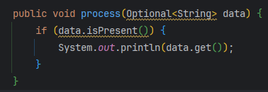

# Optional 안티패턴과 null

Optional을 잘못 쓰는 이유

- **과도한 설계(Overengineering)**: 더 간단한 방법이면 충분한 곳에도 `Optional`을 덧붙이는 경우
- **계층 설계의 오용**: 리포지토리나 캐시 계층에서 `Optional`을 부적절하게 사용하는 경우
- **가독성 문제**: 명확함보다 혼란을 주는 복잡한 `Optional` 체이닝

https://medium.com/@arun.narayan/java-optional-anti-patterns-avoid-these-traps-for-cleaner-code-37cea5945265

이 글에서 그래도 기억하면 좋을 패턴을 한번 정리해보았다.

그리고 예전에는 이해하지 못했는데 지금 보면 이해할 수 있을 것 같아서 아래 영상을 한번 다시 보고 Java의 NULL을 안전하게 다루는 방법을 정리해보았다.

https://www.youtube.com/watch?v=vX3yY_36Sk4&t=323s

### 1. 파라미터에 Optional 매개변수를 넣는다.

`Optional`은 “값이 없을 수도 있음”을 반환값에서 표현하라고 만든 타입이지, 메서드 인자(파라미터)로 받으라고 만든 게 아니다. *(* [Optional (Java SE 17 & JDK 17)](https://docs.oracle.com/en/java/javase/17/docs/api/java.base/java/util/Optional.html)

이 정의 외에도 2가지 단점이 존재한다.

- 보일러 플레이트 증가
- 그에 따라 가독성이 떨어짐.

아주 간단한 코드의 경우에도 보일러플레이트가 증가하는 것을 확인해볼 수 있다. 




파라미터로 받는 메서드의 경우 Optional에 값이 존재하는지 검증해야하는 코드가 항상 필요하며

해당 메서드를 사용하려는 다른 코드에서는 항상 String 값을 Optional로 래핑해서 전달해야한다.


Optional만 제거해도 값을 그대로 줄 수 있고 null 체크를 if 없이 진행할 수 있다.

또한, String value = “request”라는 값의 경우 Optional로 래핑하며 들어가는 불필요한 오버헤드까지 발생하게된다. (널 값이 아닌 값인데 Optional로 래핑할 경우)

### 2. get()을 isPresent()없이 사용한다.

get()은 주의해서 사용해야한다. → 런타임 에러를 발생시키는 범인이 될 수 있음

```java
Optional<String> name = Optional.ofNullable(null);
System.out.println(name.get()); // Throws NoSuchElementException
```

따라서 OOP 강의에서 말했던 것 처럼 orElse()나 orElseThrow로 Optional.empty()일 경우를 핸들링하자


orElse → 값 대체

orElseThrow → 예외 처리

궁극적으로는 get()과 isPresent()는 둘다 사용하지 않는게 좋다! 

isPresent()라는 메서드는 결국 if( 객체 == null)을 사용하는것과 차이가 없기 때문에 사용을 지양하자!

### 7. Repository 계층에서 Optional을 반환한다.

```java
public Optional<User> findUserById(String userId) {
    // Query the database
    return Optional.ofNullable(user);
}

// Usage:
User user = userRepository.findUserById("123").orElseThrow(() -> new UserNotFoundException());
```

이게 안티패턴 ?! 내 코드는 모두 이런데..?

→ Spring Data JPA는 이게 맞다. 따라서, 메서드 시그니처를 새로 만들 때 왠만하면 Optional로 만들기 ( 프레임워크 표준화)

이 예시에서 말하는건 여러 레이어를 지나가면서 하위 수준의 컴포넌트에서 Optional을 반환하게 되면 여러번 래핑/언래핑 (불필요한 wrapping과 unwrapping 오버헤드가 발생된다.) 될 수 있기 때문에 안티패턴이라고 말한다.

- Repo/DAO는 “**저장소 접근**”
- Service(**상위 경계)에서 한 번만** 정책(예외/기본값)을 결정

즉, Repository에서 Return할 때 부재 가능성을 명시하고 (NULL 가능) 이를 Service에서 처리하는 걸 말한다.

```java
// Repository Layer :
public User findUserById(String userId) {
    return entityManager.find(User.class, userId);
}

// Service layer:
User user = Optional.ofNullable(userRepository.findUserById("123"))
        .orElseThrow(() -> new UserNotFoundException());
```

이렇게 하면 장점은 저수준 구현체를 바꿔끼는 작업을 진행할 때 대부분의 저수준 구현체들은 return 규약이 null이기 때문에 API 변경없이 구현체를 변경할 수 있다.

<aside>
💡

관련해서 null 관련 강의를 보았을 때 null을 return하지 말라고 강조하는데, 이게 저수준에 대한 null return과 고수준 컴포넌트에 대한 null return의 차이점인 것 같다는 생각이 드는데 관련해서 gpt도 답변을 잘 못해줘서 이건 뭔가 팀 컨벤션이지 않을까하는 생각이 드네요 

</aside>

### 9. Optional + 예외 혼용

```java
public Optional<User> getUserById(String userId) {
    if (userId == null) {
        throw new IllegalArgumentException("UserId cannot be null");
    }
    return Optional.ofNullable(findUserById(userId));
}

// Usage:
Optional<User> user = userService.getUserById(null); // Throws exception
```

이 코드를 보면 getUserbyId를 사용하는 사용자는 Optional로 받아야하면서 도중에 예외가 발생할 수 있음을 인지하고 예외처리까지 진행해줘야한다. → **API 예측 가능성**을 떨어뜨린다. (**결과 채널이 두 개**: 같은 “실패”라도 어떤 건 예외, 어떤 건 Optional.empty.)

따라서 다음과 같이 규약을 한정하는 방법으로 바꿔볼 수 있다.

 

```java
public User getUserById(String userId) {
    if (userId == null) {
        throw new IllegalArgumentException("UserId cannot be null");
    }
    return findUserById(userId);
}

// Usage:
User user = Optional.ofNullable(userService.getUserById("123"))
        .orElseThrow(() -> new UserNotFoundException());
```

### 11 Streams에서 Optional 남용

```java
List<User> users = fetchUsers();
List<String> emails = users.stream()
    .map(User::getEmail) // Returns Optional<String>
    .filter(Optional::isPresent)
    .map(Optional::get)
    .collect(Collectors.toList());
```

getEmail에서 Optional<String>을 반환할 경우 해당 empty가 아닌 것들만 뽑고 거기서 값을 가져와 list로 만드는 로직인데 Optional이 남용되고 있음을 볼 수 있다.

이를 flatMap을 이용하면 다음과 같이 바꿀 수 있다.

```java
List<String> emails = fetchUsers().stream()
    .map(User::getEmail)
    .flatMap(Optional::stream)
    .collect(Collectors.toList());
```

map은 A → B로 변환하는 메서드라면

flatMap은 

[Optional["a@x"], Optional.empty(), Optional["c@y"]]

각 `Optional`을 **스트림으로 변환**하고

그 스트림들을 **순서대로 이어붙여(평탄화) 한 개의 스트림**으로 만듭니다.

- `Optional.of("a@x")` → `Stream.of("a@x")` (원소 1개)
- `Optional.empty()` → `Stream.empty()` (원소 0개)

이어붙인 결과: ["a@x", "c@y"]

```
["a@x", "c@y"]
```

즉, **값이 있는 것만 남고(empty는 자연스럽게 사라짐)**

순서는 원래 사용자 순서를 그대로 유지

<br>

## 자바에서 null을 안전하게 다루는 방법


→ 이건 나만 사용할 때 사용할 수 있음. 이유는 운영환경에는 왠만하면 disable 시켜버린다.


유용한 Null 체크 메서드 존재 → 꽤 간편하게 사용할 수 있음


Optional은 직렬화가 안된다. → 따라서 필드에 Optional을 두면 그 객체 전체를 직렬화가 필요한다면 문제가 발생한다.

강의에서 강조하는 2가지

- null을 반환하지 말아라
- Optional은 왠만하면 반환값으로 사용해라

필드에 사용하는 것은 직렬화가 안된다는 사실만 잘 알고 사용한다면 문제가 없다고 생각하신다.

 


1. API에 null을 반환하지말고 매개변수에도 넘기지 말아라
    
    
    
    - 매개변수에 null이 들어가게 되는 경우는 보통 메서드 하나로 모든 것을 처리하려고 할 때 발생할 수 있다. 어떤 특정 값을 넘기는 경우 a로직이 동작하고 아닐 경우 b로직이 동작하는 이런 로직 그리고 어떤 옵션도 없을 경우와 같은 예시가 있는데 이런 것들은 메서드로 나누어 주자.
        - 공부하다 보니까 이렇게 되면 애초에 캡슐화가 깨지게 되는 것이라는 것을 알게 되었다.
            
            즉, null을 파라미터로 넘겨야되는 상황이 온다면 캡슐화가 깨졌는지 부터 확인하는게 맞는 듯 하다.
            
    - 절대로 NULL을 반환하지 말아
        
        → Optional은 반환값이 없을 수도 있다면 사용하기
        
    - NULL 객체란?
        
        
        
        이건 오브젝트 책을 보며 학습했을 때 봤던 예시를 가져와봤다. 
        
        아래는 할인 정책이 있을 경우 discountPolicy를 이용하여 할인을 적용하고 할인 정책이 없을 경우 discountPolicy를 null로 저장하고 이를 예외로 처리하는 로직이다. 이 로직의 경우 원래라면 할인  금액을 discountPolicy가 결정하고 있었는데 if 조건문으로 Movie가 할인 금액을 결정하는 책임을 나눠갖게 된다는 문제가 생기게된다.
        
        이를 위 영상의 NULL 잘쓰는 법에서 나와있는 것처럼 null이 아니라 이건 할인이 안들어가는 정책이야를 표시하는 NoneDiscountPolicy 정책을 만들어 사용한다면 
        
        null을 사용하지 않으며 원래의 discountPolicy의 책임을 다할 수 있게된다. 
        
        
        
        
        

나머지 3개에 대해서는 강연자분이 시간이 없어서 그런지 설명을 너무 대충하셔서 따로 찾아보고 공부해야할 것 같다…

Null에 안전하다고 보장해주는 도구


즉 컴파일 시점에 null 체크 기능을 제공한다. 

만약 사용하게 되면 이렇게 될텐데 이러면 사용하고 싶지 않을 것 같다는 생각이 작용하여 두번째 그림처럼 기본이 @NonNull어노테이션이다.

즉, null일 때만 @Nullable을 붙여주면 된다.


@NonNull 이건 왜 있는지 맨날 궁금했는데 알고보니까 따로 jar파일을 추가하거나 플러그인을 추가해서 사용해야하는 거였다.

빌드 스크립트에 아래 내용 추가( 지피티가 알려준거라 각각 세부 설정은 잘 찾아봐야할 듯 싶네요)

```java
plugins {
	id 'java'
	id 'org.checkerframework' version '0.6.42'
}

의존성 추가
compileOnly("org.checkerframework:checker-qual:3.51.0")
annotationProcessor("org.checkerframework:checker:3.51.0")

checkerFramework {
	checkers = ['org.checkerframework.checker.nullness.NullnessChecker']
}
```

```java
public class PracticeNull {
    public static void main(String[] args) {
        A a = new A(null);
    }
}

class A{

    private String a;

    public A(String s){
        this.a = s;
    }
}
```


이렇게 뜹니다~

만약 널을 허용할려면 이렇게 매개변수에도 적어주고 필드에도 적어줘야 컴파일이 되네요

```java
import jakarta.annotation.Nullable;

public class PracticeNull {
    public static void main(String[] args) {
        A a = new A(null);
    }
}

class A{

    @Nullable
    private String a;

    public A(@Nullable String s){
        this.a = s;
    }
}
```

<br>

## +@ For 문 vs 스트림

### 1. 기본 타입

→ For 문 압도적 승리

이유는 컴파일러 최적화 때문이라고 하는데 이 부분은 자세하게 공부해야 제대로 이해할 것 같아서 그냥 for 문은 지금까지 40년은 더된 문법이고 Stream은 java 8에 나온거니까 최적화가 확실히 차이가 날 수 밖에 없다고 이해했다.

### 2. Wrapper 클래스

int와 같은 primitive type은 stack에 저장되어 JVM 상에서 직접 참조로 값을 바로 불러올 수
 있지만, wrapped type은 heap에 저장되어 간접적으로 주소를 가져와 값을 참조해야 한다. 
 간접 참조하는 비용이 직접 참조하는 비용보다 훨씬 비싸기 때문에, iteration cost 자체가 
 높다는 뜻이고 결국 for-loop의 컴파일러 최적화 이점이 사라진다는 것이다.

아마도 컴파일러 최적화라는 것은 연산을 예측하고 이를 더 짧은 word로 실행하는 것이라고 생각함 heap 접근이 필요해지는 순간 메모리 랜덤 access가 들어가게 되고 이는 더이상 예측 불가능한 상태가 되어버린다는게 문제인듯? 싶은데 이건 제 뇌피셜 ㅎㅎ)

### 3. 연산이 복잡한 로직

이유는 iteration cost보다 함수 로직에 대한 시간복잡도가 압도적으로 크다면 
 이는 iteration cost가 무의미해진다.
 -> 결국 남는것은 함수의 시간복잡도이므로 for-loop와 stream은 동일한 소요시간이 걸리게 된다.