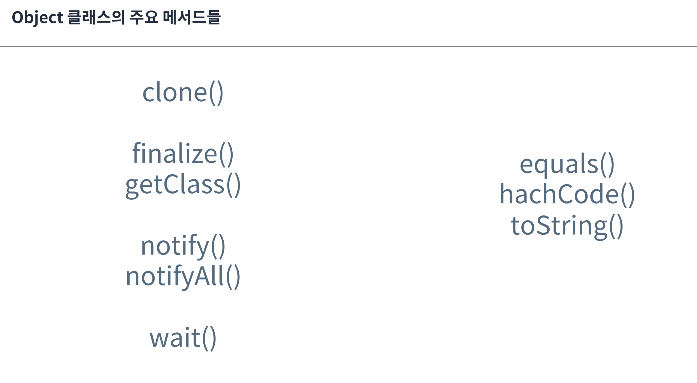
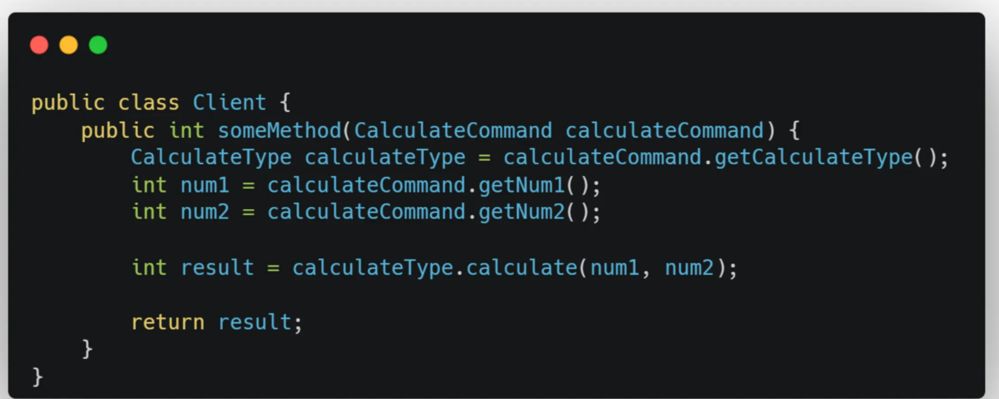

# 객체지향적으로 개발해야 하는 이유

## 강의에서 언급된 질문

- 객체지향 프로그래밍이 뭔가요?
    - 특정 문맥에서 각 객체가 맡은 역할에 따라 협력을 위해 자신만의 방법으로 책임을 수행하며, 이 책임을 수행하기 위해 메시지로 협력하는 방식의 프로그래밍 기법
- 왜 객체지향적으로 개발해야 하나요?
    - 객체 지향적으로 개발해야 하는 이유
        - 많은 개발자와 기업이 객체 지향 프로그래밍 기법을 사용하기 때문
    - 많은 개발자와 기업이 객체 지향 프로그래밍 기법을 사용하는 이유
        - 복잡하고 빠르게 변화하는 요구사항에 대응할 수 있는 유연한 소프트웨어를 개발하기 위함

## 강의에서 언급된 예시

- 붕어빵과 붕어빵 틀
    - 객체 지향 프로그래밍 기법 중 클래스 기반의 객체 지향 프로그래밍 기법에 어울리는 예시
    - 자바스크립트와 같은 프로토타입 기반의 객체 지향 또한 존재하므로 어울리지 않는 예시

- 권장되는 답변
    - 특정 문제를 객체 지향적으로 해결한 방법에 대해 언급할 것을 권장
    - 프로그래밍 기법은 결국 개발 과정에서 자주 발생하는 문제를 해결하기 위한 것이기 때문

## 객체 지향이 항상 정답인 것은 아니다

- 경우에 따라 객체 지향이 아닌 트랜잭션 스크립트 패턴 등과 같이 절차적으로 코드를 작성하는 것이 더 효율적일 수 있음

---

- 단순 코드 재사용만을 위해 상속을 사용하는 경우가 가독성 및 유지보수성을 향상시킬 수도 있음

```java
@Getter
@MappedSuperclass 
public abstract class BaseEntity {

    @CreatedDate
    private LocalDateTime createdDate;

    @LastModifiedDate
    private LocalDateTime modifiedDate;

    @Override
    public final boolean equals(Object o) {
        if (this == o) return true;
        if (o == null) return false;
        Class<?> oEffectiveClass = o instanceof HibernateProxy ? ((HibernateProxy) o).getHibernateLazyInitializer().getPersistentClass() : o.getClass();
        Class<?> thisEffectiveClass = this instanceof HibernateProxy ? ((HibernateProxy) this).getHibernateLazyInitializer().getPersistentClass() : this.getClass();
        if (thisEffectiveClass != oEffectiveClass) return false;
        Member member = (Member) o;
        return getId() != null && Objects.equals(getId(), member.getId());
    }
    
    @Override
    public final int hashCode() {
        return this instanceof HibernateProxy ? ((HibernateProxy) this).getHibernateLazyInitializer().getPersistentClass().hashCode() : getClass().hashCode();
    }
}
```

---

- 전통적인 객체 지향 프로그래밍 언어(자바/C++)와 같은 클래스 지향 프로그래밍 입장에서의 비판

> The problem with object-oriented languages is they've got all this implicit environment that they carry around with them. You wanted a banana but what you got was a gorilla holding the banana and the entire jungle.
> 
> 객체 지향 언어의 문제는 그들이 함께 가져다니는 모든 암묵적 환경이다. 당신은 바나나를 원했지만 실제로 얻은 것은 바나나를 들고 있는 고릴라와 전체 정글이었다.
- Erlang 언어의 창시자 Joe Armstrong

### Why OO Sucks

[Why OO Sucks](https://www.cs.otago.ac.nz/staffpriv/ok/Joe-Hates-OO.htm)

- 정확히는 모든 객체 지향 프로그래밍 언어에 대한 내용은 아니며, 자바나/C++과 같은 클래스 기반과 관련된 내용
- 해당 글에서 언급된 내용
    - 함수와 데이터 구조는 결합되어서는 안 됨
        - 함수와 데이터 구조는 완전히 다른 세계에 속함
        - 객체는 함수와 데이터 구조를 분리할 수 없는 단위로 결합시키기 때문에 근본적인 오류라고 주장
    - 모든 것이 객체가 되어야 한다는 강제성
        - 객체 지향 언어에서 시간은 객체여야 함
        - 비 객체지향 언어에서 시간은 단순히 데이터 타입의 인스턴스
    - 데이터 타입 정의가 곳곳에 흩어짐
        - 객체 지향 프로그래밍 언어에서는 데이터 타입 정의가 모든 곳에 흩어져 있음
        - Erlang 혹은 C에서는 모든 데이터 타입을 하나의 include 파일이나 데이터 딕셔너리에 정의할 수 있음
            - 중앙집중적 데이터 타입 정의가 더 좋다는 의견
            - 가장 많이 반박된 의견
    - 상태를 숨기는 것이 최악의 옵션
        - 객체 지향 언어가 선택한 최악의 옵션
        - 상태를 드러내고 상태의 불편함을 최소화할 방법을 찾는 대신 숨겨버리는 방법을 선택

### 메시징 기반의 객체 지향 프로그래밍

- Alan Kay가 처음으로 객체 지향 프로그래밍이라는 용어를 만들 때의 핵심 원칙
    - 메시징 : 객체들이 메시지 전송과 수신으로 상호작용
    - 로컬 보존 : 각 객체가 자신의 데이터를 관리
    - 상태-프로세스의 보호와 은닉 : 데이터와 행동(함수)의 캡슐화
    - 극단전 지연 바인딩 : 객체 행동에 대한 결정을 런타임까지 연기

| **구분** | **Alan Kay의 OOP** | **전통적인 OOP (Java/C++)** |
| --- | --- | --- |
| **핵심 철학** | 메시징 중심 | 클래스 중심 |
| **통신 방식** | 메시지 패싱 (비동기) | 메소드 호출 (동기, 직접 호출) |
| **데이터 접근** | 오직 메시지로만 접근 가능 | public 필드 직접 접근 허용 |
| **바인딩** | 지연 바인딩 (런타임) | 정적 바인딩 (컴파일 타임) |
| **타입 시스템** | 동적 타이핑 선호 | 정적 타이핑 중심 |
| **객체 개념** | 독립적 에이전트 (생물학적 세포) | 데이터 + 함수의 묶음 |
| **구현 언어** | Smalltalk, LISP | Java, C++, C# |
- 메시징 vs 메서드 호출
    - Smalltalk : `object message: parameter` → 수신자가 해석하고 응답 결정
    - Java : `object.method(parameter)` → 컴파일타임에 실행 경로 결정

## Actor

- Actor
    - 비동기적으로 메시지를 처리하는 독립적인 계산 단위
    - 각 Actor는 메시지를 수신하고 그에 따른 연산을 수행하는 독립적인 존재
- Actor가 수행할 수 있는 작업
    - 다른 Actor에게 유한한 개수의 메시지 전송
    - 유한한 개수의 새로운 Actor 생성
    - 다음에 받을 메시지에 대한 행동(Behavior) 지정
- 특징
    - 완전한 독립성
        - 각 Actor는 공유 메모리가 전혀 없음
        - 다른 Actor가 내부 상태에 직접 접근할 수 없음
        - 오직 메시지 패싱을 통해서만 소통
    - 비동기 메시지 처리
        - 각 Actor가 메시지를 수신할 수 있는 공간(메일박스)를 통해 메시지를 비동기적으로 수신하고 순차적으로 처리
        - 메시지 처리 중에도 다른 작업 동시 수행 가능
    - 장애 허용성(Fault Tolerance)
        - 부모-자식 계층 구조로 Actor 관리
        - 부모 Actor가 자식 Actor를 감시/감독(Supervision)
        - 장애 발생 시 부모 Actor가 필요한 조치 자동 수행
- 장점
    - 동시성 문제 해결
        - 공유 상태가 없으므로 Race Condition, Lock-Free 프로그래밍 가능
    - 확장성
        - Actor를 여러 노드에 분산 배치 가능
        - 각 Actor가 독립적으로 병렬 처리
    - 시스템 안정성
        - 한 Actor의 실패가 다른 Actor에 영향을 주지 않음

| **구분** | **전통적인 OOP** | **Actor 모델** |
| --- | --- | --- |
| **통신 방식** | 메소드 직접 호출 (동기) | 메시지 패싱 (비동기) |
| **상태 공유** | 공유 메모리 사용 | 완전한 상태 격리 |
| **동시성 처리** | Lock, Synchronization 필요 | 메시지 큐를 통한 자연스러운 동시성 |
| **에러 처리** | 예외 전파 | 감독자 계층을 통한 장애 관리 |

## Akka

- Actor 모델 기반의 오픈 소스

### 캡슐화의 문제점


- 일반적인 시퀀스 다이어그램


- 실행 흐름을 고려한 시퀀스 다이어그램


- 멀티 스레드의 실행 흐름을 고려한 시퀀스 다이어그램
    - 두 개의 스레드가 동일한 메서드에 진입하는 실행 구간이 있음
    - 이 경우 객체의 캡슐화는 해당 실행 구간에서 불변식을 보장하지 않음 → 공유 자원에서의 접근 문제

### **현대 컴퓨터 아키텍처에서 공유 메모리의 착각**

- 이전에는 변수에 값을 쓴다는 것은 메모리에 직접 접근한다는 의미였으나 현대에는 CPU 캐시 라인에 우선적으로 쓰게 됨
- 다른 스레드가 변경 사항을 확인하기 위해서는 캐시 라인을 다른 코어의 캐시로 전송해야 함
    - 이 과정에서 상당한 비용이 소모됨
        - 관련된 코어들이 추가 작업을 수행하는 것을 암묵적으로 중지
        - 캐시 일관성 프로토콜에서 병목 현상 발생
            - 캐시 일관성 프로토콜 : CPU가 메인 메모리와 다른 CPU 간 캐시 라인을 전송하기 위해 사용하는 프로토콜
- 자바에서의 처리 방법
    - volatile
    - Atomic Wrapper
    - 락 (JMM에서의 happens-before 보장)
- 성능 트레이드 오프
    - 강제로 가시성 문제를 해결하는 과정에서 발생하는 비용 증가
    - 어떤 변수의 가시성 문제를 해결해야 하는지 심사숙고해서 결정해야 함


### 콜 스택에 대한 환상


- 콜 스택은 멀티 스레드 환경을 고려하지 못하므로 비동기 호출 체인을 추적할 수 없음
- 스레드가 작업을 백그라운드로 위임할 때 특히 위험
    - 실제 작업을 호출한 대상과 무관하게 워커 스레드의 예외 핸들러로 전파되기 때문
    - 워커 스레드는 일반적으로 실패한 작업의 목적을 알지 못하므로 문제를 해결할 수 없을 가능성이 높음
        - 이 경우 누가 / 언제 / 어떻게 서비스를 정상 상태로 복원해야 하는지 명확한 해답이 없음
        - 단순히 새 스레드를 시작하는 것만으로는 해결되지 않는 known-good state로의 복원이 사실상 불가능
- 별도의 컴포넌트(side-channel과 같은)을 통해서만 호출자에게 현재 상태를 전파할 수 있음
    - 호출자에게 문제가 전달되지 않는 경우 사실상 작업이 손실 된 것과 동일
- 콜 스택이 멀티 스레드 환경을 고려하지 못하기 때문에 작업이 손실될 가능성이 높음
    - 네트워크 환경이 아니더라도 발생할 수 있음

# 클래스와 상속

## 상속과 다형성

- 다형성
    - 문맥 내에서 동일한 메시지를 수행하기 위해 객체가 자기 자신만의 방식으로 응답하는 것
    - 다형성을 이루기 위해서는 타입이 필요함 → 타입 다형성
- 타입
    - 동일한 퍼블릭 인터페이스를 제공하여 객체들이 서로 대체될 수 있는 가능성을 의미
    - 해당 클래스가 상속 / 구현을 하더라도 상위 타입으로 표현되기 때문

- 올바른 상속
    - 계층화와 서브타이핑을 위해 사용하는 상속
- 계층화
    - 상속 / 인터페이스 구현을 통해 타입 간 부모-자식 관계가 형성되어 만들어지는 구조적 체계
    - 서브타이핑을 구현하기 위한 구조적 기반
    - 특징
        - 추상화 수준의 분리 : 상위 계층일수록 더 추상적이고 일반적인 개념을 다루며, 하위 계층으로 내려갈수록 더 구체적이고 특화된 구현 담당
        - 다형성 지원 : 계층 구조를 통해 상위 타입 참조로 하위 타입 객체를 다룰 수 있도록 다형성 지원
- 서브타이핑(Subtyping)
    - 인터페이스 상속
    - 하위 타입이 상위 타입을 안전하게 대체할 수 있는 관계
    - 타입 다형성의 종류 중 하나
    - 특징
        - 행동 호환성
            - 서브 타입이 슈퍼 타입이 하는 모든 행동을 동일하게 수행할 수 있어야 함
            - 클라이언트 입장에서 부모 클래스 타입으로 자식 클래스를 사용해도 무방해야 함
        - 대체 가능성
            - 서브 타입의 인스턴스는 슈퍼 타입의 인스턴스를 언제라도 대체할 수 있어야 함
            - 리스코프 치환 원칙
- 서브클래싱 (Subclassing)
    - 구현 상속 / 클래스 상속
    - 코드 재사용을 목적으로 사용 → 행동 호환성을 고려하지 않음 → 타입 다형성과 무관
- 결론
    - 상속은 계층화와 서브타이핑을 위해서 사용해야 함
    - 상속은 다형성을 제공하는 수단 중 하나로 타입의 대체 가능성을 고려해 사용해야 함

## 오버라이딩

- 부모 클래스에서 상속받은 메서드는 자식 클래스에서 정의하는 것
- 표준 애노테이션을 통해 컴파일에게 검사를 제공하는 기능을 주로 사용
- 동적 다형성을 동적 바인딩을 통해 지원
- 동일한 메시지에 대해 각 객체가 자신의 타입에 맞는 고유한 책임으로 응답할 수 있게 하는 메커니즘

- 동적 다형성 (What)
    - 런타임에 객체의 실제 유형에 따라 메서드 호출을 동적으로 해결하는 특성
    - 객체 지향의 특성
- 동적 바인딩 (How)
    - 메서드 호출이 런타임에 해결되는 메커니즘
    - 컴파일에서의 실행 대상과 런타임에서의 실행 대상이 달라지는 현상
    - 동적 다형성 구현 기법

## 오버로딩

- 동일한 메서드 이름으로 파라미터, 리턴 타입이 다른 메서드를 여러 개 정의하는 것
    - 리턴 타입만 달라서는 오버로딩을 사용할 수 없음
- 정적 다형성을 정적 바인딩을 통해 지원
- 동일한 작업 의도(협력)를 가진 메서드를 서로 다른 매개변수 조합으로 정의하여 다양한 상황에 맞는 처리를 가능하게 하는 메커니즘

- 정적 다형성 (What)
    - 컴파일 시점에 결정되는 다형성
    - 동일한 메서드 이름으로 매개변수가 다른 여러 메서드를 정의해 하나의 이름으로 여러 구현을 제공
- 정적 바인딩 (How)
    - 컴파일 시점에 컴파일러가 메서드 호출 시 전달된 메서드 시그니처를 기준으로 어떤 메서드를 호출할지 결정
    - 컴파일 시점에서 매개변수 정보만으로 구분이 가능하므로 컴파일 타임에 바인딩 완료

## 오버로딩 vs 오버라이딩

- 협력 대상 결정 시점
    - 오버로딩 : 컴파일 시점
    - 오버라이딩 : 런타임 시점
- 다형성
    - 오버로딩 : 정적 다형성 (편의성)
    - 오버라이딩 : 동적 다형성 (객체 지향)

# 추상 클래스와 인터페이스

## 추상 클래스

- 상속으로 인한 is-a 관계
- ~의 한 종류라는 관계를 모델링
- 공통된 속성과 기능을 가니 공통 분모를 추출해 상위 클래스로 만드는 행위

## 인터페이스

- 계약으로 인한 can-do 관계
    - 구현을 통해 이 계약과 관련된 구체적인 로직을 작성하는 방식
- 객체가 수행해야 할 행동의 규약을 명시
- 구현 클래스가 반드시 지켜야 하는 추상적 계약서

## 추상 클래스 vs 인터페이스

- 다형성 구현 방식
    - 추상 클래스 : 템플릿 메서드 패턴 지원
    - 인터페이스 : 다양한 방법으로 구현 가능
- 상속 관계
    - 추상 클래스 : 단일 상속으로 강한 결합 형성 / 명확한 계층 구조
    - 인터페이스 : 다중 구현으로 느슨한 결합 형성 / 유연한 조합
- 책임과 역할
    - 추상 클래스 : 공통 필드와 메서드 모두 제공
    - 인터페이스 : 순수한 행동 명세만 제공
- 사용 기준
    - 추상 클래스 : 계층화와 서브 타이핑을 지원해 진정한 상속 관계를 구현할 수 있는 경우(템플릿 메서드 패턴)

## 추상 클래스 사용 권장 상황


- 계층화 / 서브타이핑을 항상 고려해야 함
    - 부모 클래스와 자식 클래스가 강하게 결합되는 것이 당연한 경우
    - 부모 클래스와 자식 클래스의 라이프 사이클이 정확히 동일한 경우
    - 부모 클래스의 변경 사항이 자식 클래스에게 전파되는 것이 자연스러운 경우

# Enum

## 안티 패턴


- 단순하게 상수처럼 사용하는 상황에서 해당 Enum을 기준으로 분기문을 처리하는 경우
    - 로직 처리 기준이 클라이언트에게 노출됨 → 클라이언트와 로직이 강하게 결합 → 변경의 여파가 미치는 범위가 넓어짐

## 권장되는 패턴

- 순수하게 상수만을 표현하기 위해 사용하는 경우
    - 상수의 의미를 타입으로도 표현하기 때문에 좀 더 명확하게 처리 가능
- 전략 패턴
    - Enum의 각 요소(상수)가 하나의 전략이 되는 방식
    - 데이터와 로직 모두 Enum에 포함되어 있으므로 적절히 캡슐화 되어 있는 형태
- 상태 패턴
    - 단순하고 명확한 상태를 관리하는 경우 적합
        - Enum 상수는 싱글톤이기 때문에 상태별로 다른 데이터를 관리할 수 없음


## Enum 비교

- == 비교 권장
    - Enum.equals() 내부적으로 == 비교 사용
    - 컴파일 시점에서의 타입 안정성 제공
        - 다른 타입의 Enum인 경우 컴파일 에러 발생
        - equals()는 다른 타입의 Enum을 비교하는 경우 무조건 false 반환

# 예외

## 강의 내용 요약

- Checked Exception과 Unchecked Exception은 무슨 차이인가요?
    - 컴파일 시점에 예외 처리를 강제하느냐 여부
- Checked Exception의 문제점
    - 호출하는 클라이언트 입장에서 해당 예외를 처리할 수 있을 것이라는 확신이 없음
    - 클라이언트 입장에서는 관심도 없고 처리할 수도 없는 예외를 강제로 알아야만 함

## 커스텀 예외 구현 방식

### 계층형 커스텀 예외

- 설명
    - 비즈니스 도메인에 특화된 예외 클래스들을 계층적으로 설계하는 방식
    - 하나의 예외에 하나의 커스텀 예외를 구현하는 방식
- 장점
    - 도메인 특화 표현 : 비즈니스 로직에 맞춤형 예외 정의 가능
    - 상세한 예외 정보 : 예외 이름, 메시지, 에러코드 등 풍부한 정보 제공
    - 유연한 처리 : 계층적 구조로 예외별 차별화된 처리 가능
- 단점
    - 복잡한 구조 : 관리해야 할 예외 클래스 및 계층 구조의 복잡성으로 인한 유지보수 복잡성
    - 학습 비용 : 예외 구현체를 직접 확인해야 함

### 표준 예외 우선 사용

- 설명
    - 자바에서 제공하는 표준 예외를 최대한 활용
    - 표준 예외만으로 표현하기 어렵거나 추가적인 정보가 반드시 필요한 경우에만 커스텀 예외 구현
        - 상황과 커스텀 예외를 확실히 묶기 위해 해당 예외가 발생하는 클래스에 내부 클래스로 생성
- 장점
    - 높은 가독성 : 익숙한 표준 예외 사용
    - 사용 편의성 : 별도 학습 없이 즉시 사용 가능
    - 유지보수 용이 : 예외 클래스 관리 부담 최소화
- 단점
    - 내부 클래스 패턴 : 클래스 별 내부 예외 선언 시 클래스 구조가 복잡해질 수 있음
    - 판단 비용 : 표준 예외로 충분한지, 커스텀 예외가 필요한지 매번 판단해야 함
    - 표준 예외 학습 필요 : 어떤 표준 예외를 언제 사용해야 하는지 학습해야 함

# Object



- notify()
    - 모니터 락에서 상호 협력을 위해 Wait Set에서 대기하고 있던 스레드 중 하나를 랜덤하게 깨움
    - 어떤 스레드를 깨울지는 결정할 수 없음
- notifyAll()
    - 모니터 락에서 상호 협력을 위해 Wait Set에서 대기하고 있던 모든 스레드를 깨움
- wait()
    - 상호 협력 조건 변수를 충족하지 못하는 상황의 스레드를 Wait Set에서 대기하도록 설정

# Optional

## 안티 패턴

```java
// 잘못된 방식
Optional<String> optional = getName();
if (optional.isPresent()) {
    String name = optional.get();
    System.out.println(name.toUpperCase());
}

// 올바른 방식
Optional<String> optional = getName();
optional.ifPresent(name -> System.out.println(name.toUpperCase()));

String result = optional
    .map(String::toUpperCase)
    .orElse("DEFAULT");
```

- isPresent() - get()
    - null 체크를 하는 로직과 동일

```java
// 잘못된 방식
public class User {
    private Optional<String> name = Optional.empty();
    private Optional<Integer> age;
    
    public Optional<String> getName() {
        return name;
    }
}

// 올바른 방식
public class User {
    private String name;
    private Integer age;
    
    public Optional<String> getName() {
        return Optional.ofNullable(name);
    }
}
```

- Optional을 필드로 사용하는 경우
    - Optional 설계 의도는 메서드의 반환 타입으로만 사용하는 것
    - 필드에 대한 단일 책임 원칙 위반
        - 하나의 필드가 값 저장과 상태 표현이라는 두 가지 책임을 가지게 됨

```java
// 잘못된 방식
public void processUser(Optional<String> name) {
    if (name != null && name.isPresent()) {
        // 처리 로직*
    }
}

// 올바른 방식 - 메서드 오버로딩
public void processUser(String name) {
    if (name != null) {
        // 처리 로직
    }
}

public void processUser() {
    // name이 없는 경우의 처리
}
```

- Optional을 파라미터로 사용하는 경우
    - Optional 또한 참조변수이므로 Optional 자체가 null이 될 수 있음 → 2중 null 체크
    - Optional 설계 의도는 메서드의 반환 타입으로만 사용하는 것

```java
 // 잘못된 방식
Optional<String> optional = Optional.ofNullable(getName());
String result = optional.get(); // NoSuchElementException 위험

// 올바른 방식
String result = optional.orElse("기본값");
    
// 또는 예외와 함께
String result = optional.orElseThrow(() -> new IllegalStateException("이름이 없습니다"));
```

- 별도의 처리 없이 get() 호출
    - get()은 Optional 내부 값이 null일 때 NPE가 발생하므로 별도의 처리가 필요함

```java
// 잘못된 방식 - 항상 실행됨
Optional<String> optional = Optional.of("값");
String result = optional.orElse(expensiveOperation()); // 불필요한 연산

// 올바른 방식 - 필요시에만 실행
String result = optional.orElseGet(() -> expensiveOperation());
```

- orElse()와 orElseGet() 동작을 혼동하는 경우
    - orElse()는 항상 파라미터를 평가하므로 비효율적
    - orElseGet()으로 지연 평가를 수행할 수 있도록 처리

```java
// 잘못된 방식 - 박싱/언박싱 비용
Optional<Integer> count = Optional.of(42);
int value = count.get();

// 올바른 방식 - 전용 클래스 사용
OptionalInt count = OptionalInt.of(42);
int value = count.getAsInt();
```

- 기본 타입에 Optional 사용
    - Wrapping 용 Optional 사용

```java
// 잘못된 방식
public Optional<List<User>> getUsers() {
    List<User> users = findUsers();
    return Optional.ofNullable(users);
}

// 올바른 방식 - 빈 컬렉션 반환
public List<User> getUsers() {
    List<User> users = findUsers();
    return users != null ? users : Collections.emptyList();
}
```

- Collection에 Optional 사용
    - 요소가 없는 경우 빈 Collection을 반환하는 것이 적합

# if문 제거하기

- early return
- 캡슐화
    - Enum 안으로 넣기 → 데이터와 로직을 하나로 묶는 방식
    - 생성 시점에 유효성 검사 → 관련 로직을 하나로 묶기

# getter와 setter

## getter



- 목표로 하는 로직(문맥)
    - 두 가지의 숫자(num1, num2)에 대해 원하는 사칙연산(CalculateType)을 수행하는 것
- 현재 메시지
    - 계산 명령(CalculateCommand)에게 사칙연산 종류(CalculateType)를 요청하는 메시지
    - 계산 명령(CalculateCommand)에게 첫 번째 숫자(num1)를 요청하는 메시지
    - 계산 명령(CalculateCommand)에게 두 번째 숫자(num2)를 요청하는 메시지
    - 사칙연산 종류(CalculateType)에게 두 숫자(num1, num2)에 대한 연산을 요청하는 메시지
- 문제점
    - 너무 구체적인 메시지
        - CalculateCommand 내부 값을 모두 가져와서 원하는 로직을 직접 수행
    - 너무 많은 메시지
        - 메시지의 변경이 발생하면 해당 메시지를 호출하는 측이 반드시 변경의 여파를 받게 됨


- 현재 메시지
    - 계산 명령(CalculateCommand)에게 계산 결과를 요청하는 메시지
- 개선 사항
    - 간결한 메시지
        - 변경의 여파를 받는 구간 감소
    - CalculateCommand에 대한 응집도를 높여 캡슐화 및 Client-CalculateCommand 간 결합도를 낮춤
        - 클라이언트는 원하는 요청에 대한 메시지만을 수행
        - 클라이언트가 자세한 로직에 대해 알 필요 없음

## setter

- 생성자 대신 setter를 사용하는 경우
    - 불완전한 객체가 나올 수 있음
    - 변경해서는 안 될 값을 변경할 수 있음

### Factory 패턴


> 모든 객체지향 언어에서 객체 생성 메커니즘을 제공하지만 다른 객체와 분리된 좀 더 추상적인 생성 메커니즘이 필요하다.
자신의 책임이 다른 객체를 생성하는 것인 프로그램 요소를 FACTORY라고 한다.
>
- 객체에서 객체 생성 로직과 객체 비즈니스 로직은 서로 이질적
    - 클래스 지향 언어에서 객체 생성(인스턴스화)이란 단순히 객체의 비즈니스를 사용하기 위해 메모리에 구체화하기 위한 수단
        - 객체의 메서드를 호출하기 위해서는 클래스가 인스턴스화되어야 하기 때문
    - 객체 비즈니스 로직이 핵심

- 정적 팩토리 메서드
    - 이질적인 객체 생성 로직을 클래스 내부에서 외부(static)으로 분리
    - 객체 초기화 로직이 복잡할수록 효과가 좋음
        - private 메서드였던 초기화 로직을 private static으로 문맥 분리

- 팩토리 패턴
    - 객체의 복잡한 초기화 로직을 외부로 옮기는 패턴
    - 팩토리 내부에는 복잡한 초기화 및 불변식을 지키도록 하더라도 외부 클라이언트에서는 이를 알 수 없으며 알 필요도 없음
    - 클라이언트는 팩토리에게 메시지를 통해 원하는 상태의 인스턴스를 요청하고 응답받은 인스턴스로부터 원하는 로직을 호출하기 위한 메시지 전달

# stream API

- 객체 지향 프로그래밍에서 가독성을 높일 수 있는 방법

# stream API와 Optional

- 스트림에는 함수형 패러다임이 적용되어 있음
- Optional과 함께 사용하면 가독성을 높일 수 있음

## Parallel

- Sequence Stream은 실행한 스레드 풀에서 이어서 실행(동기적)
- Parallel Stream은 ForkJoinPool.commonPool()에서 실행
    - 기본적으로 (사용 가능한 프로세서 - 1)개의 스레드 사용 → 시스템의 프로세서 수에 따라 스레드 수가 동적으로 조정
    - work-stealing 알고리즘을 통해 효율적인 작업 분배
- 주의사항
    - 모든 ParallelStream이 하나의 ForkJoinPool.commonPool()을 공유
    - 하나의 스레드 풀을 사용하기 때문에 블로킹 I/O 발생 시 치명적
    - 병렬 처리로 인한 동시성 문제 → 동시성 문제를 해결하는 경우 성능 저하 발생
    - 처리 순서를 보장하지 않음
- 권장 사용시점
    - CPU Burst + 블로킹 I/O 작업이 없는 경우
    - 독립적인 연산으로 동시성 문제가 발생하지 않는 경우
    - 충분히 큰 데이터셋으로 병렬 처리 오버헤드보다 이득이 큰 경우
    - 순서에 의존하지 않는 로직인 경우
